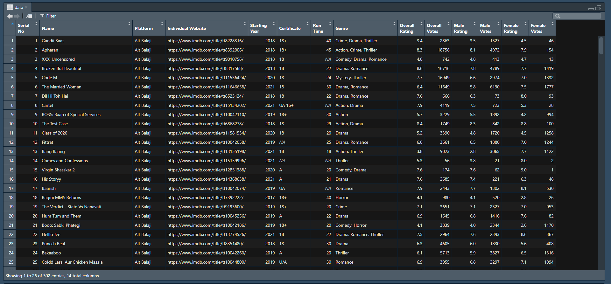

```{r setup, include=FALSE}
knitr::opts_chunk$set(echo = TRUE)
knitr::opts_chunk$set(warning = FALSE, message = FALSE)
```


```{r echo=FALSE}
library(ggplot2)
library(reshape)
library(tidyverse)
library(GGally)
library(gridExtra)

load("finaldata.Rdata")
```

\pagebreak

\tableofcontents

\pagebreak

\section{\underline{Introduction}}

The project is based on **Indian Web Series** Data.

  - **What is a Web Series?**
  
    A web Series is a show/program that runs on an internet streaming platform rather than running on Television. As the popularity of the internet has grown tremendously over the past couple of years, the popularity of such shows has grown similarly. In India people used to be addicted to Television before 2014-15. But with the increased number of internet users, the user base for streaming platforms has also significantly grown in India. "Let's Netflix and Chill" has become one of the most popular lines among the youth today. We can surely get an idea about the popularity of web series from all this.
    
  - **Why did we choose Indian Web Series?**
  
    Now, the major reason for specifically choosing Indian web Series and not the other 'Hollywood' web series like Big Bang Theory, Game of Thrones, etc. is because there have already been hundreds of analyses done on these. You can just go on the internet, type their name and you will find multiple visualizations, analyses, etc. not just on the web series but also on their episodes; just because of the fact that these have been there for a very long period of time.
    
    On the other hand, the concept of Web Shows and Web Series is comparatively new to India. The growth of Indian web series has only been happening for the last 5-6 years. 
    
    As we wanted to do something new, we chose this.
    
    The other reason for this is that the Indian audience is a huge audience. It has been one of the most targeted audiences in the world by everyone around the globe. So to get an insight into the preferences of the Indian Audience surely lets the directors know which direction to move in. For example, soon after the success of 'Mirzapur' and 'Sacred Games', which are some Indian origin action and crime web series, we saw a tremendous increase in the release of such crime and drama web series in India such as 'Paataal Lok', 'Criminal Justice', etc. Now, what does it tell us about the liking of the audience? This is the information that we want to get from this data set. We want to know how these web series managed to get so popular among the audience which was so used to those melodramatic TV series like 'Kyunki Saas Bhi Kabhi Bahu Thi', 'Kasautii Zindagi Kay' or even Indian mythological Series such as 'Ramayana' and Mahabharata'.
    
  - **Goal of the project:**
  
    The eventual goal of this project is to get some insightful information regarding the platforms, genre, and overall preferences of the Indian audience when it comes to watching Indian web shows. The data that we have collected will surely help us gain some knowledge about the mindset of the people behind these streaming platforms as to what their target audience is, which genre is most liked by the Indian audience so far, and overall help us get a little understanding of the patterns in which these shows are being released to suit the Indian audience. We will not be doing any kind of Statistical Analysis on this data so hence our conclusions will be based on purely what the data says through multiple visualizations performed in our Shiny App for all the different questions that we have regarding this target audience.
    

\section{\underline{Dataset Description}}

1. \underline{Obtaining the data:}
  - Source:
    We collected all the data required for this project from the website IMDb.
    - IMDb or Internet Movie Database is the most popular, authoritative online database containing information about various films, television series, video games, and streaming content, along with information about actors and directors, cast and crew, box office collection, trailers, and other related content.
    - Website link: \underline{https://www.imdb.com/}
    
  - Data Scrapped:
    We scrapped data about the top web series of the various Indian web series streaming platforms.
    
    Data has been scraped scrapped for the following platforms:  
    Alt Balaji, Amazon Prime, Hotstar, MX Player, Sony LIV, TVF, Voot Select, and Zee5  
    And the individual page link of each platform on the IMDb website are as follows –
    - Alt Balaji: https://www.imdb.com/search/title/?companies=co0642697
    - Amazon Prime: https://www.imdb.com/list/ls099967158/?st_dt=&mode=detail&page=1&sort=moviemeter,asc
    - Hotstar: https://www.imdb.com/search/title/?companies=co0800964
    - MX Player: https://www.imdb.com/search/title/?companies=co0721599
    - Sony LIV: https://www.imdb.com/search/title/?companies=co0546496
    - TVF: https://www.imdb.com/search/keyword/?keywords=tvf
    - Voot Select: https://www.imdb.com/search/title/?companies=co0603531
    - Zee5: https://www.imdb.com/search/title/?companies=co0692549&sort=user_rating,desc

  - Now, for each web series, we scrapped data about its Genre, Certificate, Run time, Starting year, Overall Ratings and Votes, and male and female ratings and votes.
    
2. \underline{Methods and libraries used:}
  - We used R language to scrape the data from IMDb using the RStudio software.
  - And we used the following libraries for scraping:
    ```{r, results='hide'}
        library(rvest)
        library(tidyverse)
    
    ```
    - Rvest: We used this package to load the source code of a website page in R and then search for various information inside the code.  
      The functions like read_html, html_elements, html_attr, html_text, and html_table inside this package help us do the scrapping.
      
    - Tidyverse: This library we used to perform various kinds of string manipulations that were needed to scrape the particular information we needed.  
      The functions str_sub, str_trim, str_replace_all, str_remove_all, etc. were used repeatedly in the code to get the desired string form.
      Also, this package contains the pipe operator, ‘%>%’ which came in handy in almost every line of the code.
      
3. \underline{Date and Time of scrapping:}
  As, in IMDb, the users rate and vote for the web series, the list of top web series may shuffle with time.
  This is why we should mention the date and time of scrapping the data.
  We scrapped data for all the web series from IMDb on 16th October 2022 at about 11 pm.
  
4. \underline{Data frame description:}
  Finally, the scrapping process was done and we ended with a data frame with 14 columns and 302 rows which looks like this –  
  
    ```{r echo = FALSE, out.width = "110%", fig.align = "left"}
    
    ```
  
  - Column description:
    The final data frame contains columns that are described as follows –
    ```{r echo = FALSE}
    Column_Name <- c("Serial No","Name","Platform","Individual Website",
                 "Starting Year","Certificate","Run Time","Genre","
Overall Rating","Overall Votes","Male Rating","Male Votes","Female Rating","Female Votes")

Content <- c("The serial number of every observation",
"Name of the web series",
"Name of the platform a web series belongs to",
"Webpage link of web series in IMDB site",
"Starting year of a series",
"Certificate category a web series",
"Average length of each episode of a series",
"Genre of a web series",
"Rating of a particular series",
"Total number of votes given to a particular series",
"Ratings given by males",
"Votes given by males",
"Ratings given by females",
"Votes given by females")

Data_type <- c(
  "Integer","String","String","String","Integer","String","Integer","String",
  "Integer","Integer","Integer","Integer","Integer","Integer"
)

tab <- data.frame(Column_Name,Content,Data_type)

knitr::kable(tab , "pipe" , align = c("c","c","c") , col.names = c("Column_Name","Content","Data Type"))
    ```
    
  - Row description:
    As mentioned above we got 302 web series entries which include the top web series of the eight platforms mentioned above.  
    But due to the unavailability of entries, the number of web series corresponding to each platform is not the same. It varies from 50 to a minimum of 10.  
    The platform-wise distribution is as follows –
    ```{r}
    table(data$Platform)
    ```
    
    
    
    
5. \underline{Problems tackled while scrapping and the way outs:}
  Among many problems that we faced during scrapping the data, notable ones are –
    - As usual and with no surprise, there was a lot of missing values on the websites.
      Like in many cases there was no mention of Run time and in many cases, the certificate information was missing.  
      And the total number of perfect rows we got was 149 only.  
      Now, this created a problem in the early stage of scrapping because we were trying to scrape the data column-wise. Like, were writing codes to scrape the entries for the ‘Run time’ column of all the web series and finally make a data frame using the columns.  
      But thanks to the missing values we were getting columns of different lengths which not only were problematic to create a data frame but also we had no idea about which web series the missing value corresponds to.  
      Then came a suggestion from our fellow friend which changed our entire methods.  
      Now we were scrapping row-wise. Meaning, we were taking the chunk of code that maps an individual web series and were searching inside that chunk for our required columns, and putting ‘NA’ in the case of missing values.
    - In some of the platforms, we noticed a lot of duplicated value in the ‘Name of the Web series’ column and after a small-scale investigation, we found that after some web series, entries corresponding to episodes of web series were coming instead of web series as a whole.  
     For example, on the webpage for the ‘Top web series’ of Hotstar, different rows were there for the episodes ‘Ab judge karo mujhe’, ‘Disco Deewane’, and ‘Hawa Hawai’ of the web series ‘Hundred’, which was not desirable for us. So, we removed those entries by manually putting some limits over the scrapping range.
     
6. \underline{Adding two more columns:}
  In this stage, we find that there were 17 different of certificates in our dataset, and for the continuous variable ‘Runtime’ we had 46 different entries.  
    ```{r}
    length(unique(data$Certificate))
    ```
  Note that we ignored the two certifications, namely ‘Not Rated’ and ‘NA’ which are appearing here as unique certifications. And,  
    ```{r}
    length(unique(data$`Run Time`))
    ```
  Now for certificates, as handling this many categories would have been a difficult task and also comparing them all with one another would give a messy outcome, we categorized the ‘Certificate’ column suitably and created one new column.  
  And for the continuous type variable ‘Run time’ too, we did the similar thing of categorizing them into suitable categories.
    - Certificate Category:  
      We categorized the web series into three categories with respect to their watchability to different age groups, viz.
      - For ‘Family and Kids’: With the following certification – ‘12+’, ‘UA 7+’, ‘U’, ‘7+’, ‘All’
      - For ‘Teenagers’: With the following certification – ‘UA’, ‘UA 16+’, ‘U/A’, ‘PG’, ‘16+’, ‘16’, ‘13’, ‘15+’, ‘UA 13+’
      - For ‘Adults’: With the following certification – ‘18+’, ‘18’, ‘A’
      - And we filled in ‘NA’ for the certifications ‘Not Rated’ and ‘NA’
    - Length Category:  
      Here again, we categorized the web series into three categories with respect to the average length of episodes of that web series, viz.
      - 'Short’ length web series: With an average length of episodes being less than 20 minutes.
      - ‘Medium’ length web series: With an average length of episodes being in between 20 minutes and 40 minutes.
      - ‘Long’ length web series: With an average length of episodes being more than 40 minutes.
      - And we filled ‘NA’ in the case of missing values of Run time.
    
7. So, finally our data frame consists of 302 rows and 16 columns altogether.
    ```{r}
    dim(data)
    ```
  

\section{\underline{Possible Biases in the data}}

Biases impact the quality of the data analysis significantly. Thus it is important to ensure that our analysis is free of those. As no data is free of biases, it is quite difficult to eliminate them. So, here we identify the bias embedded in our data:

  - \underline{Selection Bias:}
    Selection bias occurs when our data is not representative of the target population. Some scopes of selection biases in our data are as follows-
    - Scrapping only from the website IMDb:  
      There may be various other websites with ratings and votes of web series, which we didn't take into our consideration. But we only analyzed data about web series coming from this particular website and this may induce Selection Bias.
    - Considering only eight platforms:  
    According to https://www.getfleek.app/blog/ott-platforms-in-india, there are at least 20 OTT platforms in India streaming web series with or without cost.  
    But we only considered eight platforms according to the availability of data on these platforms, which again can induce Selection Bias.
    - Scrapping only top web series:  
    We only scrapped data top 50 or 20 web series from each platform. But certainly, there are many more. If we considered them all then the trends might have been different from what they are now. So, this is clearly a significant source of Selection Bias.
    - Also, in the context of our analysis, this bias occurs as the female votes are way less than the males. So our data is biased towards males.


\section{\underline{Some interesting questions:}}
  1. Which certificates, which genre, and what length of web series are the most popular amongst people?
  2. Does the length of a web series affect the engagement of the audience with the web series?
  3. Is there any potential difference between the preferences of males and females when it comes to web series?
  4. Which genre works best on which platform?
  5. Which platform targets which age groups?
  
  These are some questions we thought can be asked from the data scrapped above. And, in the course of this project, we will try to answer these with the help of some data visualizing tools.
  


\section{\underline{Shiny App}}

1. \underline{Libraries used:}
The different libraries we used to run the app and plot the graphs are as follows-
    ```{r,results='hide'}
    library(shiny)
    library(ggplot2)
    library(reshape)
    library(tidyverse)
    library(plotly)
    library(GGally)
    library(shinythemes)
    ```
    
2. \underline{Description of Shiny app:}
The Shiny App has **3 sections**, viz.
  - \underline{Overall Visualizations:}  
  In this section, we see some plain visualization of different features of the data. For this,
    - First we get an option to choose **platforms**. Here we can choose all the platforms at once or can select a particular platform as per our needs.   
    - Then, we get the **field of comparison**. For this, we have **three** options-
      - Comparing Certificate Category
      - Comparing Genre
      - Comparing Length Category
    - Then, we get further option to select the **basis of comparison**, and in this section, we have got **two**
    options-
      - Comparison with Ratings
      - Comparison with Votes
    - After selecting these two options, we get a **bar plot** with bars being different categories of the field of comparison and the heights representing the selected basis of comparison, e.g. **comparing Genres with respect to Votes.**
    - Then we also have a **check box**, selecting which we get a **side-by-side bar plot** with **Male Female classification** of the same bar plot described above.
  - \underline{Platform Wise Comparison:}  
  In this section we tried to show some comparisons between the different platforms we have got.  
    - We have chosen three factors for comparison, viz.
      - Comparison with respect to **Run time**
      - Comparison with respect to **targeted Age group**
      - Comparison with respect to **popular Genre**
    - In the first scenario, we get a **side-by-side box plot** of the average **run times of the web series** of different platforms to compare them with each other.
    - In the second case, we get a **percentage bar plot** with components of each bar showing **three components** corresponding to the proportion of web series with the **three different certificate categories** of a platform.  
    Thus we get to compare the **targeted audience** of different platforms.
    - And finally we have a **multiple donut chart** with each donut representing the proportion of **different genres** of each platform. Here for the sake of comparison, we have taken only the popular genres that are common to each platform. 
    Here we compare the platforms with respect to their **most popular genre**.
  - \underline{Finding Association:}  
  This section focuses on **finding association** between different variables in our data. For example - **Overall Votes** vs **Overall Ratings** or **Run time** vs **Votes and Ratings**.
    - For the first case, we get a **scatter plot of overall** votes vs overall ratings with each web series **color-coded by the platform** it belongs to.  
    This plot checks for any association between the two aforementioned variables.
    - For the second case, we get a **scatter plot matrix** with three variables viz. **run time**, **votes**, and **ratings**, and by this try to see some relation between these three variables.
  - We note that in all the five plots described in Section 2 and Section 3, we have the **option** to **choose platforms** according to our need and in the first plot of the third section we have a **slider** to control the **outliers** in the data.
  
\pagebreak

\section{\underline{Some important visualizations}}

\subsection{1. \underline{Most Voted Genre:}}
```{r echo=FALSE, fig.align='center', fig.height = 3.1, fig.width = 6}
#defining data and limit for taking the genres having appearances more than this
data1 <- data
limit <- 7

#removing rows with NA values
data1 <- na.omit(data1)

#splitting 'genre' columns to consider all genres of a webseries
split.g <- str_split(data1$Genre, ",")

#creating dataframe of all the genres and the webseries identification from where it comes
f.vector <- vector()

index <- 0
for (i in 1:dim(data1)[1])
{
  len <- length(split.g[[i]])
  for (j in 1:len){
    f.vector[index + 1] <- i
    f.vector[index + 2] <- str_trim(split.g[[i]][j])
    index = index + 2
  }
}

d.gen <- data.frame( f.vector[seq(2, length(f.vector), by = 2)],
                     as.numeric(f.vector[seq(1, length(f.vector), by = 2)]),
                     stringsAsFactors = F)
colnames(d.gen) <- c("Genre", "Web_no")

#finding unique genres in the above data frame
u.gen <- unique(d.gen$Genre)

#initiating blank vector for scores of different certificate categories
score <- numeric(length = length(u.gen))

#assinging score to the genres
for (i in 1:length(u.gen))
{
  index <- which(d.gen$Genre == u.gen[i])
  index <- d.gen$Web_no[index]
  score[i] <- mean(data1$`Overall Votes`[index])
}

#selecting only the genres which appears more than 'limit'  number of times
sel.gen <- vector()
f.score <- numeric()
index <- 1

for (i in 1:length(u.gen))
{
  if (sum(d.gen$Genre == u.gen[i]) > limit)
  {
    sel.gen[index] <- u.gen[i]
    f.score[index] <- score[i]
    index <- index + 1
  }
}

#defining dataframe for plotting using ggplot
df7 <- data.frame(sel.gen, f.score)

#ggplot
ggplot(data=df7, aes(x = sel.gen, y = f.score)) +
  geom_bar(stat="identity", fill="darkorchid") +
  labs(title = "Bar Diagram", 
       subtitle = "Comparing Overall Votes across popular Genres", 
       x = "Genre", y = "Votes") + 
  theme(plot.title = element_text(size = 16), 
        plot.subtitle = element_text(size = 12), 
        axis.title = element_text(size = 11),
        axis.text = element_text(size = 10))
```
So, from the above plot, the genre with the highest number of votes is 'Drama'


\subsection{2. \underline{Most voted Certificate category:}}
```{r echo=FALSE, fig.align='center', fig.height = 3.1, fig.width = 6}
#defining the data
dat <- data

#removing rows with NA values
dat <- na.omit(dat)

#getting unique certificate categories
cer <- unique(dat$`Certificate Category`)

#initiating blank vector for scores of different certificate categories
score <- numeric(length = length(cer))

#assinging score to the certificate categories
for (i in 1:length(cer))
{
  
  a <- subset(dat, dat$`Certificate Category` == cer[i])
  
  score[i] <- mean(a$`Overall Votes`)
}

#defining dataframe for plotting using ggplot
df3 <- data.frame(cer, score)

#arranging the categories according to our desired arrangement
f.df3 <- df3
f.df3$cer <- factor(f.df3$cer,                                    
                    levels = c("Family and Kids", "Teenagers", "Adults"))

#ggplot
ggplot(data=f.df3, aes(x = cer, y = score)) +
  geom_bar(stat="identity", fill="darkorchid") + 
  labs(title = "Bar Diagram", 
       subtitle = "Comparing Overall Votes across Certificate Categories", 
       x = "Certificate Category", y = "Overall Votes") + 
  theme(plot.title = element_text(size = 16), 
        plot.subtitle = element_text(size = 12), 
        axis.title = element_text(size = 11),
        axis.text = element_text(size = 10))
```
From the above plot, we get the Certificate category with the highest votes is the 'Adults' category.


\subsection{3. \underline{Most Voted Length category:}}
```{r echo=FALSE, fig.align='center', fig.height = 3.4, fig.width = 6}
#defining the data
dat <- data

#removing rows with NA values
dat <- na.omit(dat)

#getting unique length categories
len <- unique(dat$`Length Category`)

#initiating blank vector for scores of different length categories
score <- numeric(length = length(len))

#assigning score to the length categories
for (i in 1:length(len))
{
  
  a <- subset(dat, dat$`Length Category` == len[i])
  
  score[i] <- mean(a$`Overall Votes`)
}

#defining dataframe for plotting using ggplot
df11 <- data.frame(len, score)

#arranging the categories according to our desired arrangement
f.df11 <- df11
f.df11$len <- factor(f.df11$len,                                    
                     levels = c("Short", "Medium", "Long"))

#ggplot
ggplot(data=f.df11, aes(x = len, y = score)) +
  geom_bar(stat="identity", fill="darkorchid") + 
  labs(title = "Bar Diagram", 
       subtitle = "Comparing Overall Votes across Web series Length", 
       x = "Length Category", y = "Overall Votes") + 
  theme(plot.title = element_text(size = 16), 
        plot.subtitle = element_text(size = 12), 
        axis.title = element_text(size = 11),
        axis.text = element_text(size = 10))
```
From the above plot, the most voted length category is the 'Short' length web series.

\subsection{4. \underline{Gender classification of votes of web series:}}
- \underline{Across different Genres:}
```{r echo=FALSE, fig.align='center', fig.height = 4.1, fig.width = 8}
#defining data and limit for taking the genres having appearances more than this
data1 <- data
limit <- 7

#removing rows with NA values
data1 <- na.omit(data1)

#splitting 'genre' columns to consider all genres of a webseries
split.g <- str_split(data1$Genre, ",")

#creating dataframe of all the genres and the webseries identification from where it comes
f.vector <- vector()

index <- 0
for (i in 1:dim(data1)[1])
{
  len <- length(split.g[[i]])
  for (j in 1:len){
    f.vector[index + 1] <- i
    f.vector[index + 2] <- str_trim(split.g[[i]][j])
    index = index + 2
  }
}

d.gen <- data.frame( f.vector[seq(2, length(f.vector), by = 2)],
                     as.numeric(f.vector[seq(1, length(f.vector), by = 2)]),
                     stringsAsFactors = F)
colnames(d.gen) <- c("Genre", "Web_no")

#finding unique genres in the above data frame
u.gen <- unique(d.gen$Genre)

#initiating blank vector for scores of different certificate categories for males and females
score1 <- numeric(length = length(u.gen))
score2 <- numeric(length = length(u.gen))

#assinging score to the genres
for (i in 1:length(u.gen))
{
  index <- which(d.gen$Genre == u.gen[i])
  index <- d.gen$Web_no[index]
  score1[i] <- mean(data1$`Male Votes`[index])
  score2[i] <- mean(data1$`Female Votes`[index])
}

#selecting only the genres which appears more than 'limit'  number of times
sel.gen <- vector()
Male <- numeric()
Female <- numeric()
index <- 1

for (i in 1:length(u.gen))
{
  if (sum(d.gen$Genre == u.gen[i]) > limit)
  {
    sel.gen[index] <- u.gen[i]
    Male[index] <- score1[i]
    Female[index] <- score2[i]
    index <- index + 1
  }
}

#defining dataframe for plotting using ggplot
df8 <- data.frame(Male, Female, sel.gen)

#creating suitable data frame for comparing gender wise
dum <- melt(df8, id.vars='sel.gen')
colnames(dum) <- c("gen", "Gender", "value")

#ggplot
ggplot(dum, aes(x=gen, y=value, fill=Gender)) +
  geom_bar(stat='identity', position='dodge')  +
  labs(title = "Side-by-side Bar Diagram", 
       subtitle = "Comparison of male and female votes across popular Genres", 
       x = "Genre", y = "Votes") + 
  theme(plot.title = element_text(size = 17), 
        plot.subtitle = element_text(size = 15), 
        axis.title = element_text(size = 14),
        axis.text = element_text(size = 13),
        legend.title=element_text(size=14), 
        legend.text=element_text(size=13))
```
- \underline{Across different Certificate Categories:}
```{r echo=FALSE, fig.align='center', fig.height = 3.9, fig.width = 8}
#defining data
dat <- data

#removing rows with NA values
dat <- na.omit(dat)

#getting unique certificate categories
cer <- unique(dat$`Certificate Category`)

#initiating blank vector for scores of different certificate categories for males and females
Male <- numeric(length = length(cer))
Female <- numeric(length = length(cer))

#assinging score to the certificate categories
for (i in 1:length(cer))
{
  
  a <- subset(dat, dat$`Certificate Category` == cer[i])
  Male[i] <- mean(a$`Male Votes`)
  Female[i] <- mean(a$`Female Votes`)
}

#defining dataframe for plotting using ggplot
df4 <- data.frame(Male, Female, cer)

#arranging the categories according to our desired arrangement
f.df4 <- df4
f.df4$cer <- factor(f.df4$cer,                                    
                    levels = c("Family and Kids", "Teenagers", "Adults"))

#creating suitable data frame for comparing gender wise
dum <- melt(f.df4, id.vars='cer')
colnames(dum) <- c("cer", "Gender", "value")

#ggplot
ggplot(dum, aes(x=cer, y=value, fill=Gender)) +
  geom_bar(stat='identity', position='dodge')  + 
  labs(title = "Side-by-side Bar Diagram", 
       subtitle = "Comparison of male and female votes for different Certificate Categories", 
       x = "Certificate Category", y = "Overall Votes") + 
  theme(plot.title = element_text(size = 17), 
        plot.subtitle = element_text(size = 15), 
        axis.title = element_text(size = 14),
        axis.text = element_text(size = 13),
        legend.title=element_text(size=14), 
        legend.text=element_text(size=13))
```
- \underline{Across different Length Categories:}
```{r echo=FALSE, fig.align='center', fig.height = 3.9, fig.width = 8}
#defining data
dat <- data

#removing rows with NA values
dat <- na.omit(dat)

#getting unique length categories
len <- unique(dat$`Length Category`)

#initiating blank vector for scores of different length categories for males and females
Male <- numeric(length = length(len))
Female <- numeric(length = length(len))

#assigning score to the length categories
for (i in 1:length(len))
{
  
  a <- subset(dat, dat$`Length Category` == len[i])
  Male[i] <- mean(a$`Male Votes`)
  Female[i] <- mean(a$`Female Votes`)
}

#defining dataframe for plotting using ggplot
df12 <- data.frame(Male, Female, len)

#arranging the categories according to our desired arrangement
f.df12 <- df12
f.df12$len <- factor(f.df12$len,                                    
                     levels = c("Short", "Medium", "Long"))

#creating suitable data frame for comparing gender wise
dum <- melt(f.df12, id.vars='len')
colnames(dum) <- c("len", "Gender", "value")

#ggplot
ggplot(dum, aes(x=len, y=value, fill=Gender)) +
  geom_bar(stat='identity', position='dodge')  + 
  labs(title = "Side-by-side Bar Diagram", 
       subtitle = "Comparison of male and female votes for different Lengths", 
       x = "Length Category", y = "Overall Votes") + 
  theme(plot.title = element_text(size = 17), 
        plot.subtitle = element_text(size = 15), 
        axis.title = element_text(size = 14),
        axis.text = element_text(size = 13),
        legend.title = element_text(size = 14), 
        legend.text = element_text(size = 13))
```

- From the above three plots, it can be easily seen that votes given by women are invariably less than that of men irrespective of comparison with respect to Genres or Certificate categories or Length categories.
- Also note that the plot of 'Genre vs Votes' (Plot 1) showed us the genre 'Drama' was most voted when overall votes were considered, whereas if we look at the Male and Female votes separately (in Plot 4(a)), then Male votes for 'Crime' and 'Action' dominates 'Drama'.


\subsection{5. \underline{Most Rated Genre, Certificate category, and Length category:}}
```{r echo=FALSE, fig.align='center', fig.height = 2.5, fig.width = 4.3}
#defining data and limit for taking the genres having appearances more than this
data1 <- data
limit <- 7

#removing rows with NA values
data1 <- na.omit(data1)

#splitting 'genre' columns to consider all genres of a webseries
split.g <- str_split(data1$Genre, ",")

#creating dataframe of all the genres and the webseries identification from where it comes
f.vector <- vector()

index <- 0
for (i in 1:dim(data1)[1])
{
  len <- length(split.g[[i]])
  for (j in 1:len){
    f.vector[index + 1] <- i
    f.vector[index + 2] <- str_trim(split.g[[i]][j])
    index = index + 2
  }
}

d.gen <- data.frame( f.vector[seq(2, length(f.vector), by = 2)],
                     as.numeric(f.vector[seq(1, length(f.vector), by = 2)]),
                     stringsAsFactors = F)
colnames(d.gen) <- c("Genre", "Web_no")

#finding unique genres in the above data frame
u.gen <- unique(d.gen$Genre)

#initiating blank vector for scores of different certificate categories
score <- numeric(length = length(u.gen))

#assinging score to the genres
for (i in 1:length(u.gen))
{
  index <- which(d.gen$Genre == u.gen[i])
  index <- d.gen$Web_no[index]
  score[i] <- mean(data1$`Overall Rating`[index])
}

#selecting only the genres which appears more than 'limit'  number of times
sel.gen <- vector()
f.score <- numeric()
index <- 1

for (i in 1:length(u.gen))
{
  if (sum(d.gen$Genre == u.gen[i]) > limit)
  {
    sel.gen[index] <- u.gen[i]
    f.score[index] <- score[i]
    index <- index + 1
  }
}

#defining dataframe for plotting using ggplot
df5 <- data.frame(sel.gen, f.score)

#ggplot
ggplot(data=df5, aes(x = sel.gen, y = f.score)) +
  geom_bar(stat="identity", fill="darkorchid") + 
  ylim(0, 10) +
  labs(title = "Bar Diagram", 
       subtitle = "Comparing Ratings across popular Genres", 
       x = "Genre", y = "Ratings") + 
  theme(plot.title = element_text(size = 14), 
        plot.subtitle = element_text(size = 11), 
        axis.title = element_text(size = 10),
        axis.text = element_text(size = 9))
```
```{r echo=FALSE, fig.align='center', fig.height = 2.5, fig.width = 4.3}
dat <- data
#removing rows with NA values
dat <- na.omit(dat)

#getting unique certificate categories
cer <- unique(dat$`Certificate Category`)

#initiating blank vector for scores of different certificate categories
score <- numeric(length = length(cer))

#assinging score to the certificate categories
for (i in 1:length(cer))
{
  
  a <- subset(dat, dat$`Certificate Category` == cer[i])
  
  score[i] <- mean(a$`Overall Rating`)
}

#defining dataframe for plotting using ggplot
df1 <- data.frame(cer, score)

#arranging the categories according to our desired arrangement
f.df1 <- df1
f.df1$cer <- factor(f.df1$cer,                                    
                    levels = c("Family and Kids", "Teenagers", "Adults"))

#ggplot
ggplot(data=f.df1, aes(x = cer, y = score)) +
  geom_bar(stat="identity", fill="darkorchid") + 
  ylim(0, 10) +
  labs(title = "Bar Diagram", 
       subtitle = "Comparing Ratings across Certificate Categories", 
       x = "Certificate Category", y = "Ratings") + 
  theme(plot.title = element_text(size = 14), 
        plot.subtitle = element_text(size = 11), 
        axis.title = element_text(size = 10),
        axis.text = element_text(size = 9))
```
```{r echo=FALSE, fig.align='center', fig.height = 2.5, fig.width = 4.3}
dat <- data
#removing rows with NA values
dat <- na.omit(dat)

#getting unique length categories
len <- unique(dat$`Length Category`)

#initiating blank vector for scores of different length categories
score <- numeric(length = length(len))

#assigning score to the length categories
for (i in 1:length(len))
{
  
  a <- subset(dat, dat$`Length Category` == len[i])
  
  score[i] <- mean(a$`Overall Rating`)
}

#defining dataframe for plotting using ggplot
df9 <- data.frame(len, score)

#arranging the categories according to our desired arrangement
f.df9 <- df9
f.df9$len <- factor(f.df9$len,                                    
                    levels = c("Short", "Medium", "Long"))

#ggplot
ggplot(data=f.df9, aes(x = len, y = score)) +
  geom_bar(stat="identity", fill="darkorchid") + 
  ylim(0, 10) +
  labs(title = "Bar Diagram", 
       subtitle = "Comparing Ratings across Web series Length", 
       x = "Length Category", y = "Ratings") + 
  theme(plot.title = element_text(size = 14), 
        plot.subtitle = element_text(size = 11), 
        axis.title = element_text(size = 10),
        axis.text = element_text(size = 9))
```

We can see that there may be some variations of ratings of different categories in the above three plots but they are not significantly different. 

\subsection{6. \underline{Which genre is most popular on which platform?}}
```{r echo=FALSE, fig.align='center', fig.height = 8, fig.width = 8}
#selected platforms
plat <- c("Alt Balaji", "Amazon Prime", "MX Player",    
          "Sony LIV", "Voot Select", "Zee5")

#defining list to hold data frames for each platform
mt <- list()

#creating data frame of each platform with platform, genre and frequency
for (i in 1:length(plat))
{
  new <- subset(data , data$Platform == plat[i])
  all_gen_plat <- strsplit(new$Genre , ",")
  vec = c()
  for(a in 1:length(all_gen_plat))
  {
    for(b in 1:length(all_gen_plat[[a]]))
    {
      vec = c(vec, all_gen_plat[[a]][b])
    }
  }
  
  vec <- gsub(" ","",vec)
  t <- table(vec)
  
  df <- data.frame(plat[i], t)
  colnames(df) <- c("Platform", "Genre", "Frequency")
  
  mt[[i]] <- df
  
}

#crating a single data frame with all the data frame of 'mt'
final <- mt[[1]]

if (length(plat) > 1)     #if else to handle the situation when there is only one platform selected
{
  for (i in 2:length(mt))
  {
    final <- rbind(final, mt[[i]])
  }
}

#finding common genre of the selected platfroms
com <- unique(final$Genre)

for (i in 1:length(plat))
{
  a <- subset(final, final$Platform == plat[i])
  ge <- a$Genre
  com <- intersect(com, ge)
}

#subsetting dataframe to the common genres
b <- mt[[1]]
final2 <- subset(b, b$Genre %in% com)

if (length(plat) >1)        #if else to handle the situation when there is only one platform selected
{
  for (i in 2:length(plat))
  {
    b <- mt[[i]]
    c <- subset(b, b$Genre %in% com)
    final2 <- rbind(final2, c)
  }
}

#ggplot
ggplot(final2, aes(x = Platform, y = Frequency, fill = Genre)) +
  geom_bar(position="fill", stat="identity") +
  scale_fill_viridis_d() +
  coord_polar("y")  + 
  labs(title = "Multiple Donut Chart", 
       subtitle = "Comparison of Genre of different Platforms", 
       x = "Platforms", y = "") + 
  theme(plot.title = element_text(size = 20), 
        plot.subtitle = element_text(size = 15), 
        axis.title = element_text(size = 15),
        axis.text = element_text(size = 13),
        legend.title = element_text(size = 14), 
        legend.text = element_text(size = 13))
```


The above Multiple Donut Chart answers the question posed.

From the above chart, observations about the most popular genres are as follows :

  - In each platform, the genre 'Drama' is predominantly significant.
  - Voot Select mostly prefers 'Action' and 'Crime' whereas Amazon Prime prefers 'Action' and 'Comedy'.
  - 'Horror' is invariably less preferred by all
  - In Alt Balaji, 'Romance' is dominant whereas 'Thriller' dominates MX Player.


\subsection{7. \underline{Which platform targets which age group?}}  
The following Percentage Bar Plot shows what proportion of the web series in each platform belongs to the Adult category or Teenagers category or Family and Kids category-
```{r echo=FALSE, fig.align='center', fig.height =3.5, fig.width = 8}
#selected platforms
plat <- unique(data$Platform)

#defining list to hold data frames for each platform
mt <- list()

#creating data frame of each platform with certificate category and their count of appearance and saving them in 'mt' list
for(i in 1:length(plat))
{
  sub <- subset(data, data$Platform %in% plat[i])
  t <- table(sub$`Certificate Category`)
  
  df <- data.frame(plat[i],t)
  colnames(df) <- c("Platform", "Certificate Category", "Proportion")
  mt[[i]] <- df
}

#crating a single data frame with all the data frame of 'mt'
final <- mt[[1]]

if (length(plat) > 1) #if else to handle the situation when there is only one platform selected
{
  for (i in 2:length(mt))
  {
    final <- rbind(final, mt[[i]])
  }
}

#ggplot
ggplot(data = final, aes(x = Platform, y = Proportion, fill = `Certificate Category`)) +
  geom_bar(position="fill", stat="identity")  + 
  labs(title = "Percentage Bar plot", 
       subtitle = "Comparison of certificate category of different Platforms", 
       x = "Platforms") + 
  theme(plot.title = element_text(size = 14), 
        plot.subtitle = element_text(size = 10), 
        axis.title = element_text(size = 10),
        axis.text = element_text(size = 9),
        legend.title = element_text(size = 10), 
        legend.text = element_text(size = 9))
```
- The key observations are as follows -
  - Sony LIV and TVF target all categories equally
  - Alt Balaji mainly targets the 'Adult' section whereas the rest of the platforms focus on the 'Teenager' section.

\subsection{8. \underline{Comparison of average runtime of different platforms:}}
```{r echo=FALSE, fig.align='center', fig.height =4, fig.width = 8}
#selected platforms
plat <- unique(data$Platform)

#refining data set according to the chosen platform
new <- subset(data , data$Platform %in% plat)

#taking only platform and runtime column
new <- data.frame(new$Platform, new$`Run Time`)
colnames(new) <- c("Platform", "Run Time")

#removing missing values
new <- na.omit(new)

#ggplot
ggplot(data = new, aes(x = Platform, y = `Run Time`)) +
  geom_boxplot(fill = "darkturquoise")  + 
  labs(title = "Side-by-side Box plot", 
       subtitle = "Comparison of average runtime of different Platforms", 
       x = "Platforms", y = "Average run time (in min)") + 
  theme(plot.title = element_text(size = 14), 
        plot.subtitle = element_text(size = 10), 
        axis.title = element_text(size = 10),
        axis.text = element_text(size = 9))
```
From the above plot, we have two highlights:

- Firstly, Platforms like Alt Balaji and TVF have the average run time of web series varying over a very small range whereas for  MX Player, Voot Select, and Zee5 it varies moderately. And we see a large variation in the average run time of web series for Hotstar, Amazon Prime, and Sony LIV. 
- Secondly, we have platforms like Alt Balaji and Sony LIV with median run time of less than 25 minutes whereas we also have platforms like Amazon Prime and Hotstar with median run time of 45 minutes. And for the rest of the platforms, the average run time lies between 25 minutes to 30 minutes.

\subsection{9. \underline{Visualizing Votes-Ratings association:}}
```{r echo=FALSE, fig.align='center', fig.height =3.6, fig.width = 8}
#selected platforms
plat <- c("Alt Balaji", "Hotstar", "MX Player",    
          "Sony LIV", "Voot Select", "Zee5", "TVF")

#defining list to hold data frames for each platform
new <- list()

#creating data frame of each platform with name, platform, votes and ratings
for ( i in 1:length(plat))
{
  sub <- subset(data, data$Platform %in% plat[i])                                              #subsetting data w.r.t the chosen platforms
  df <- data.frame(sub$Name, sub$Platform, sub$`Overall Votes`, sub$`Overall Rating`)          #selecting required columns
  df <- na.omit(df)                                                                            #removinf missing values
  colnames(df) <- c("Name", "Platform","Overall Votes","Overall Rating")
  
  tr <- 20                                                                                     #input of percentage of outlier to be trimmed
  tr <- tr/100
  tr <- tr/2
  
  df <- df%>% filter(between(`Overall Votes`,                                                  #trimming the outliers                                                
                             quantile(`Overall Votes`, tr),
                             quantile(`Overall Votes`, (1 - tr))))
  
  new[[i]] <- df
  
}

#crating a single data frame with all the data frame of 'mt'
final <- new[[1]]

if (length(plat) > 1)                #if else to handle the situation when there is only one platform selected
{
  for (i in 2:length(plat))
  {
    final <- rbind(final,new[[i]])
  }
}

#removing missing values from the original dataset and stroing it 
a <- na.omit(data)       

#ggplot
ggplot() +
  geom_point(data = final, aes(x = `Overall Rating`, y = `Overall Votes`, color = Platform, label = Name)) +                                               #points w.r.t different platfroms
  geom_smooth(data = final, aes(x = `Overall Rating`, y = `Overall Votes`, color = Platform), method = "lm", formula = y ~ x, se = FALSE, size = 0.5) +    #regression lines of individual platforms
  geom_smooth(data = a, aes(x = `Overall Rating`, y = `Overall Votes`), method = "lm", formula = y ~ x, se = FALSE, color = "Black") +                     #overall regression line
  labs(title = "Scatterplot", 
       subtitle = "Overall Ratings vs Overall Votes", 
       x = "Overall Ratings", y = "Overall Votes",
       caption = "Note: The Black line represents the overall regression line.") + 
  theme(plot.title = element_text(size = 16), 
        plot.subtitle = element_text(size = 12), 
        axis.title = element_text(size = 12),
        axis.text = element_text(size = 10),
        legend.title = element_text(size = 12), 
        legend.text = element_text(size = 10),
        plot.caption = element_text(hjust = 0, size = 15))
```
- The above plot shows how Ratings and votes are associated with each other.  
  The black line is the overall regression line which shows a (weak) positive correlation between Votes and Ratings, i.e., in general, web series with high ratings have got more votes.  
  The regression lines for individual platforms are also given in the plot which shows us the association between Votes and Ratings for individual platforms.

- \underline{An instance of Simpson's Paradox:}  
  Simpson's Paradox appears when a trend appearing in different groups of data changes when the data is combined. This can be seen in the above scatter plot of 'Overall votes vs Overall ratings'.  
  We can see, in most of the cases, the overall regression line is relatively steeper compared to the regression lines for the individual platforms.  
  It is to be noted that for the platform TVF, the regression line is steeper than that of all platforms and the overall line too, whereas, for Alt Balaji, Zee5, and Sony LIV, the slope is even negative.


\subsection{10. \underline{Does Ratings or Votes depend on Runtime?}}

```{r echo=FALSE, fig.align='center', fig.height =6.75, fig.width = 8.5}
#selected platforms
plat <- c("Alt Balaji", "Hotstar", "MX Player",    
          "Sony LIV", "Voot Select", "Zee5", "TVF")

#subsetting data w.r.t the chosen platforms
dat <- subset(data, data$Platform %in% plat)

#removing missing values
a <- na.omit(dat)

#creating data frame with four colums only
a <- data.frame(a$`Run Time`, a$`Overall Rating`, a$`Overall Votes`, a$Platform)
colnames(a) <- c("Run Time", "Overall Ratings", "Overall Votes", "Platform")

#creating the plot
ggpairs(a, columns = 1:3,
        aes(color = Platform,  
            alpha = 0.4), diag = list(continuous = "blankDiag"),
        title = "Comparing Runtime with Overall Votes and Overall Rating") +
  theme(plot.title = element_text(size = 20)) + theme_grey(base_size = 15)
```

From the above Scatter Plot Matrix, we can see that on aggregate, there is very less dependency of Votes and Ratings on Run time. The correlation coefficients are negligible. Though some exception occurs in some platforms. For example, in TVF, Run time and Votes have a strong positive correlation or in Hotstar, Run time has a moderately positive correlation with Ratings.

\pagebreak

\section{\underline{Conclusion:}}
In this project, we have made an attempt to analyze various dimensions of Indian web series on different OTT platforms.

For this task, we extracted our data from IMDb and tried to make a few insightful plots. From these plots, we got empirical answers to some interesting questions we posed, viz. which genre is more popular among viewers, which platform targets which age group or which genre is more popular on them, how do male and female preferences differ with genres, etc. In addition to this, the shiny app we made provides a user-friendly graphical interface to enable us to select appropriate inputs and view the plots according to our interests.

With the growing popularity of web series in India, this kind of analysis on user liking and watching preferences would be of great help to the creators. It would help them to understand the choices of the audience they are catering to and make shows accordingly. The analysis is also of great importance to the OTT platforms as it helps them to understand their audience and make their future business strategies accordingly. 

The other side of the coin is that the creators may be motivated to make similar kinds of shows which have already been successful in the past. This would hamper their independent thinking, resulting in a loss of creativity. Therefore, these conclusions must be used judiciously and wisely.

Besides, the visualizations made in this project work alone can not be used for drawing concrete conclusions. Further Statistical analysis with more relevant datasets needs to be performed to be able to infer something. 


\section{\underline{References}}
- IMDb: <https://www.imdb.com>
- Google: <https://www.google.com/>
- Wikipedia: <https://www.wikipedia.org/>
- GeeksforGeeks: <https://www.geeksforgeeks.org/>
- Shiny Gallery page: <https://shiny.rstudio.com/gallery/>
- MTH208A Course Webpage: <https://dvats.github.io/teaching/MTH208.html>
- Worksheets given in MTH208A  
  
The above sources were of great help in completing this project work.
  

\section{\underline{Acknowledgment}}
We would like to express our special thanks of gratitude to our instructor Dr. Dootika Vats for her ceaseless guidance throughout the work period and for providing such a golden opportunity to work on this project work. 


